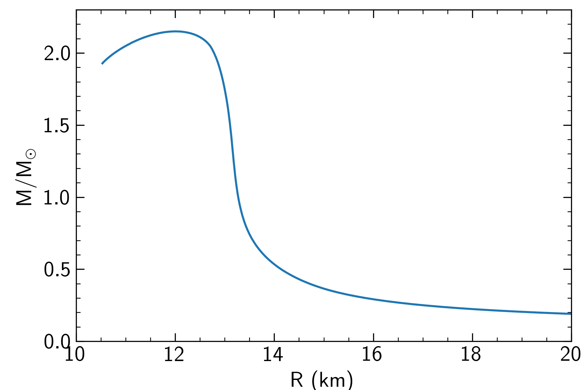
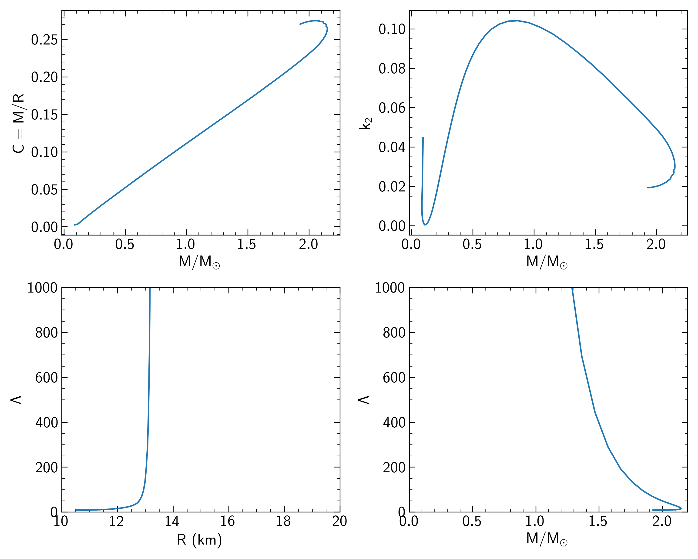

-----

# Python for TOV solver

<div class="contents">

</div>

<div class="section-numbering">

</div>

## About

Python package to solve [Tolman-Oppenheimer-Volkoff
equation](https://en.wikipedia.org/wiki/Tolman%E2%80%93Oppenheimer%E2%80%93Volkoff_equation).
Allows to study properties of static neutron stars with given equation of state.
Additionally is able to calculate tidal properties of neutron stars. The package can become quite handy 
by using from jupyter noebook.

<p align="center">
    
    
</p>

## Documentation

To install use:

``` python
pip3 install .
```

Or if you do not have root access, then to install locally:

``` python
pip3 install . --user
```


See an [**example jupyter notebook**](https://github.com/amotornenko/TOVsolver/blob/master/example/TOVsolver%20example.ipynb) in the ``example`` folder.

## Functionality

Solves TOV equation, calculates mass and radius of static neutron star at given central density.
Calculates tidal properties of neutron star.

### Literature

- [**R. C. Tolman, Phys. Rev. 55, 364 (1939)**](https://journals.aps.org/pr/abstract/10.1103/PhysRev.55.364) Static Solutions of Einstein's Field Equations for Spheres of Fluid
- [**J. R. Oppenheimer and G. M. Volkoff, Phys. Rev. 55, 374 (1939)**](https://journals.aps.org/pr/abstract/10.1103/PhysRev.55.374) On Massive Neutron Cores
- [**G. Baym, C. Pethick, and P. Sutherland, Astrophys. J. 170, 299 (1971)**](https://doi.org/10.1086/151216) The Ground State of Matter at High Densities: Equation of State and Stellar Models
- [**T. Hinderer, B. D. Lackey, R. N. Lang, and J. S. Read, Phys. Rev. D81, 123016 (2010)**](https://journals.aps.org/prd/abstract/10.1103/PhysRevD.81.123016) Tidal deformability of neutron stars with realistic equations of state and their gravitational wave signatures in binary inspiral


## License

Copyright 2019-2022 Anton Motornenko (FIAS)

This program is free software: you can redistribute it and/or modify it
under the terms of the GNU General Public License as published by the
Free Software Foundation; either [version 3 of the
License](LICENSE.txt), or (at your option) any later version.

This program is distributed in the hope that it will be useful, but
WITHOUT ANY WARRANTY; without even the implied warranty of
MERCHANTABILITY or FITNESS FOR A PARTICULAR PURPOSE. See the [GNU
General Public License](LICENSE.txt) for more details.
